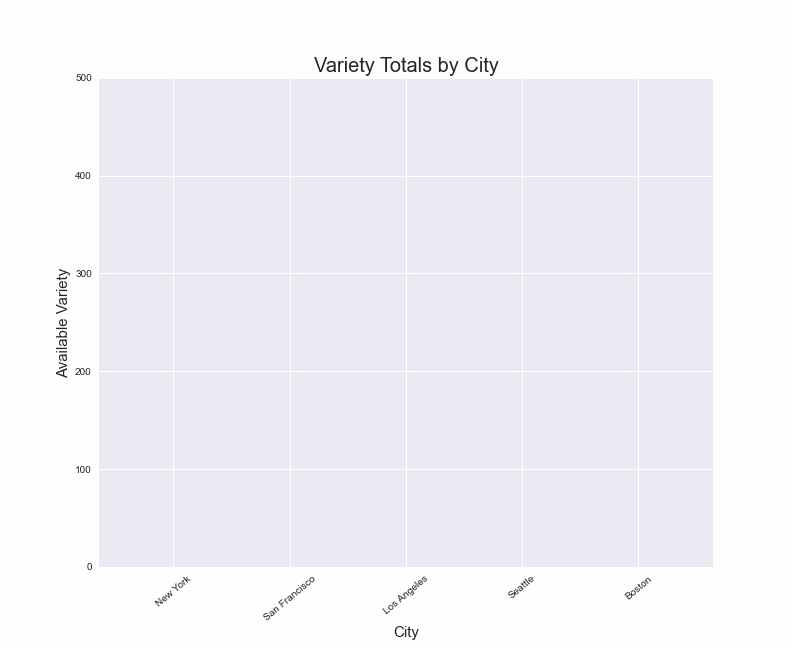

## Project Start it Up

  

##### Table of Contents  
- [Overview](#overview)  
- [Findings](#findings)  
- [Conclusion](#conclusion)
   
<a name="overview"/>
<a name="findings"/>
<a name="conclusion"/>

Investigate what relationship exists between the attractiveness of a city for startups and factors that contribute to:

* The quality of life for citizens 
* Friendliness of the business environment 

## Overview of Data Used:
To begin our search, we utilized datasets that gave us a look into where cities ranked in terms of favorability for locating a start up business. The dataset we utilized had an overall score and broke out the data based on quality, quantity, and a business rating. These data points were not very specific, so we began investigating other potential reasons that may cause cities to be ranked where they were. Two major areas that stood out were the quality of life for the citizens of the city and the friendliness of the business environment. As we looked into data, we found good data around the quantity of farmers markets and the variety they offer across the United States. We also found data regarding acceptance of Paycheck Protection Program (PPP) Loans and credit availability that were used as potential determining factors for the friendliness of the business environment in each city. 
- - - 

## Data Questions Asked:
Based on the data that we found, we sought to answer the following questions:

* Is the amount of farmers markets in an area a determining factor for startups locating in certain cities in the U.S.?
* Is there a correlation between the product variety offered at a city’s farmers markets and where it ranks on the list of startup city favorability?
* Are monetary factors such as payment types accepted and loan acceptance more likely to be the reason why startups do well in the areas they are in?
- - - 

## Findings:
For the first data question, we found the top 5 cities in the United States for startup businesses. Then, we looked into the quantity of farmers markets per city in each of those top 5 cities. San Francisco came in at number one for best city in the U.S. to locate a startup, but was not the number one city in terms of quantity of farmers markets. There was no discernible trend among the top 5 cities for startups and the quantities of farmers markets in those cities, as evidenced by the graph below. 

  

We extrapolated deeper into this data and used a linear regression to model our findings. This showed there was no correlation (a coefficient of approximately .06) between the two factors (quantity of farmers markets in a city and the ranking of that city’s favorability for locating a startup).

  

We then attempted to find a trend between the varieties of all goods offered within these farmers markets and the attractiveness for a startup business, and again were unable to find any meaningful relationship between the 2 variables. As shown below, the rankings were not represented in the variety totals offered by farmers markets per their respective cities.

  

           
Variety Graph Static

           
 

However, we were able to find quite a significant relationship between how much variety was available and how many farmers markets were in each city. This would make the most sense since more stores equals more variety possibilities. Use link below to view the regression for this.

[Regression](https://github.com/RobSalazar/Project-1/blob/main/Robert/figures/variety_reg.png)

After looking into our last point we find that our model showing loan acceptancy shows the most insight into one possible reason as to why these cities are ranked so high for startup businesses.

  

- - - 

## Conclusion:
While this aspect of quality of life is an important measure for individuals, there is no correlation between it and where a startup business will locate. While NYC seemed to be the outlier in almost every graph, we concluded the actual outlier was San Francisco. Based on our findings, it seems that there are other factors that have led up to San Francisco having the appeal it has for startups. The fact that it is home to some of the most well known startups such as Uber and Airbnb, as well as 96 other “Unicorn” startups (startups with a valuation of $1 billion), is evidence that the ecosystem there differentiates it from other cities in the United States. This ecosystem attracts other startups with potential hope of being the next “Unicorn”, and it also attracts investors to potentially get in on the ground floor. While there are likely many factors that contribute to this appealing ecosystem, we have found that farmers markets are not one of those. 

